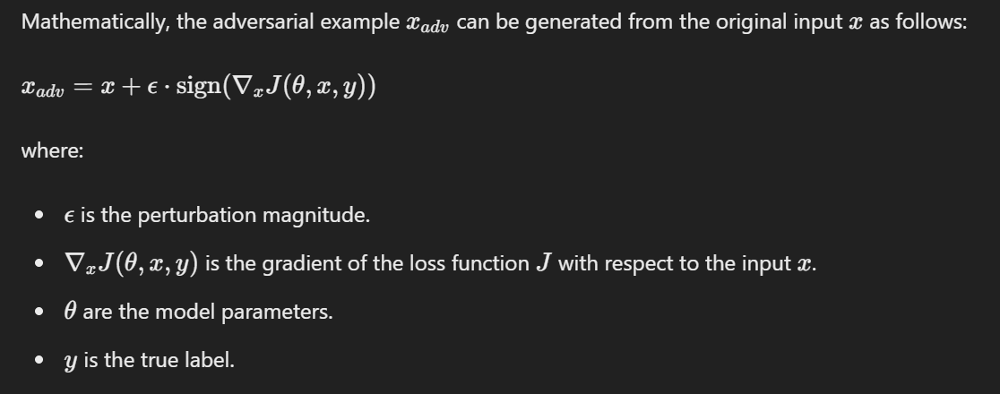

# FGSM-Adversarial-Attack

## FGSM : Fast Gradient Sign Method
It is an efficient technique used in adversarial machine learning to create adversarial examples, which are inputs to machine learning models that are intentionally designed to cause the model to make a mistake. FGSM is particularly notable for its simplicity and effectiveness in generating these adversarial examples.

## How FGSM Works ?
FGSM perturbs the input data in the direction of the gradient of the loss function with respect to the input. The core idea is to make minimal changes to the input that maximize the loss, effectively fooling the model. The perturbation is controlled by a parameter, epsilon (ε), which determines the magnitude of the perturbation.

## Steps to Implement FGSM
* **Compute the Gradient:** Calculate the gradient of the loss function with respect to the input data.
* **Determine Perturbation:** Use the sign of the gradients to determine the direction in which to perturb the input.
* **Apply Perturbation:** Add the perturbation to the input data, scaled by epsilon (ε)

## Mathematical Equation
Moreover, we try to maximize the loss wrt image pixels.

## FGSM Tensorflow Implementation
```
import tensorflow as tf

def fgsm_attack(model, x, y, epsilon):
    with tf.GradientTape() as tape:
        tape.watch(x)
        prediction = model(x)
        loss = tf.keras.losses.categorical_crossentropy(y, prediction)
    gradient = tape.gradient(loss, x)
    perturbation = epsilon * tf.sign(gradient)
    x_adv = x + perturbation
    x_adv = tf.clip_by_value(x_adv, 0, 1)  # Ensure the values are in the valid range
    return x_adv
```
## Paper
[Explaining and Harnessing Adversarial Examples](1412.6572v3.pdf) by Ian J. Goodfellow, Jonathon Shlens, and Christian Szegedy.

> 
# FGSM Adversarial Attack & Defense

## Research Overview

This project explores adversarial vulnerabilities in deep neural networks and 
develops defense mechanisms to improve model robustness. Specifically, I 
implement the Fast Gradient Sign Method (FGSM) attack and propose a defense 
strategy using Denoising AutoEncoders with Block Switch architecture.

## Key Contributions

1. **FGSM Attack Implementation**: Demonstrated how small perturbations (ε) 
   can fool state-of-the-art image classifiers
2. **Novel Defense Mechanism**: Combined Denoising AutoEncoder with Block 
   Switch model to filter adversarial perturbations
3. **Empirical Evaluation**: Tested on CIFAR10 dataset, showing improved 
   robustness against FGSM attacks

## Research Impact

This work aligns with current research challenges in adversarial machine 
learning:
- Understanding neural network vulnerabilities
- Developing practical defense mechanisms
- Balancing model accuracy with adversarial robustness

## Methodology

### Attack Phase
- Implemented FGSM using TensorFlow gradient computation
- Generated adversarial examples with varying epsilon values
- Analyzed attack success rates across different model architectures

### Defense Phase
- Designed DAE+BS architecture to denoise adversarial perturbations
- Trained defense model on both clean and adversarial examples
- Evaluated defense effectiveness using standard metrics

## Future Research Directions

1. Extending to more sophisticated attacks (PGD, C&W)
2. Exploring certified defense mechanisms
3. Investigating transferability of adversarial examples
4. Applying to real-world security-critical applications

## References

- Goodfellow, I. J., Shlens, J., & Szegedy, C. (2014). Explaining and 
  Harnessing Adversarial Examples. ICLR 2015.

## Related Work

Preparing for research internship on Security of Deep Learning Models at 
Deakin University under Prof. Gang Li.

---
**Author**: Pankaj Yadav  
**Contact**: pankajyadsv08@gmail.com  
**GitHub**: [@pankajydv07](https://github.com/pankajydv07)

> If you liked anything, do give this repo a star.
